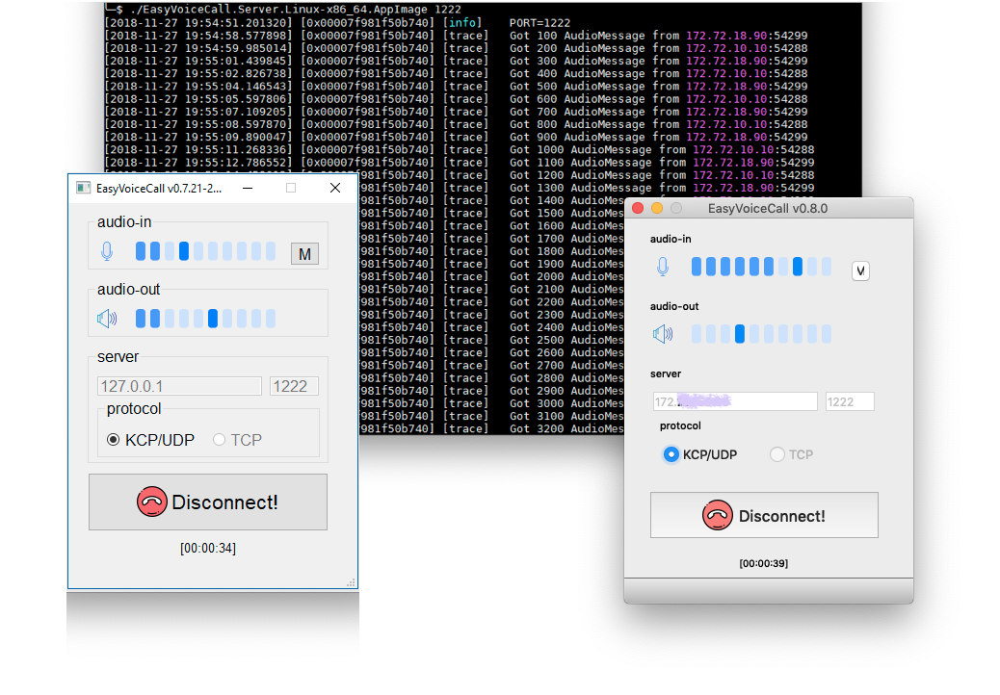

  
  
  
  

<h1 align="center">
  EVC(easy-voice-call) is a self-hosting voice chating App. 
</h1>

## User Guide
EVC is very **easy to use**
- Deploy the server
  - Download latest *EasyVoiceCall.Server.Linux-x86_64.AppImage* from https://github.com/zhang-ray/easy-voice-call/releases
  - `chmod +x EasyVoiceCall.Server.Linux-x86_64.AppImage && ./EasyVoiceCall.Server.Linux-x86_64.AppImage 1222 # 1222 is the UDP port`
- Use the client
  - Download latest *EasyVoiceCall.Client.macOS.dmg* or *EasyVoiceCall.Client.Windows.Installer* from https://github.com/zhang-ray/easy-voice-call/releases
  - Make sure your recording/playback device are ready, and then open the client!
  - Just connect to the coresponding server!
  - Waiting for the other if you're the fisrt one online and vice versa.

## License
[LICENSE](./LICENSE). By the way, [IANAL](https://en.wikipedia.org/wiki/IANAL).

## Technical details
Written in modern C++ (C++14)

**Technical features**
- [x] private and secure - the server is self-hosting;
- [x] cross platform (Windows and macOS) and easy-to-use GUI client;
- [x] Voice Activity Detection; 
- [x] Acoustic Echo Cancellation; 
- [x] Noise Suppression;
- [x] Comfort Noise Generator;
- [x] concise source code - less than 4k lines (including clients, server, unit_tests and sanity_check code);

